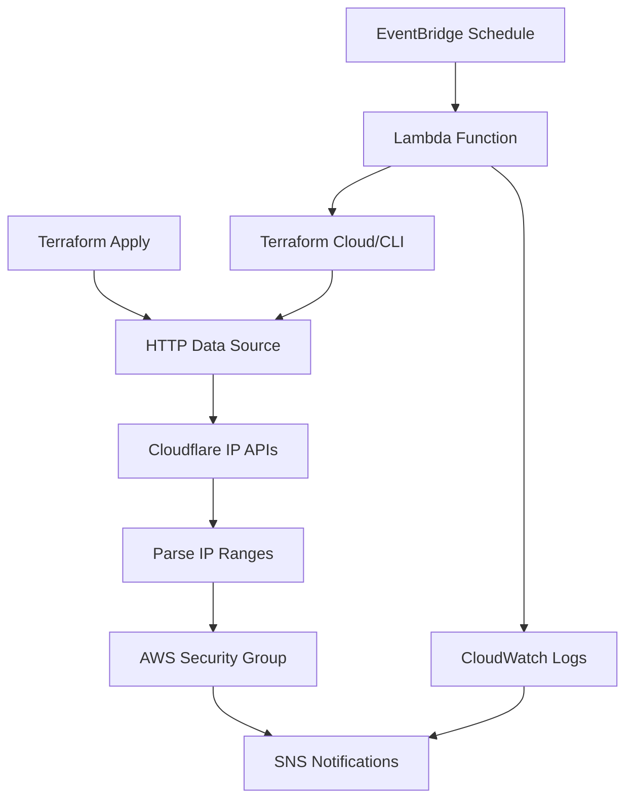

# Design Document

## Overview

This solution creates a Terraform-based infrastructure that automatically retrieves Cloudflare IP address ranges and maintains an AWS Security Group with ingress rules allowing HTTPS traffic (TCP port 443) from these IP ranges. The design includes both the initial deployment and automated updates to keep the security group current with Cloudflare's changing IP ranges.

## Architecture

The solution consists of three main components:

1. **Terraform Core Module**: Fetches Cloudflare IPs and creates/updates the security group
2. **Automation Layer**: AWS Lambda function triggered by EventBridge for scheduled updates
3. **Monitoring & Alerting**: CloudWatch logs and SNS notifications for update status



## Components and Interfaces

### 1. Terraform Core Module

**Files Structure:**
```
terraform/
├── main.tf              # Main configuration
├── variables.tf         # Input variables
├── outputs.tf          # Output values
├── data.tf             # Data sources for Cloudflare IPs
├── security-group.tf   # Security group resource
└── versions.tf         # Provider requirements
```

**Key Resources:**
- `data "http"` blocks for Cloudflare IPv4 and IPv6 endpoints
- `aws_security_group` resource with dynamic ingress rules
- `aws_security_group_rule` resources for each IP range

### 2. Data Sources

**Cloudflare IP Endpoints:**
- IPv4: `https://www.cloudflare.com/ips-v4`
- IPv6: `https://www.cloudflare.com/ips-v6`

**Data Processing:**
- Split response body by newlines to get individual CIDR blocks
- Filter out empty lines and comments
- Validate CIDR format before creating security group rules

### 3. AWS Security Group Configuration

**Security Group Properties:**
- Name: `cloudflare-whitelist-${var.environment}`
- Description: "Security group allowing HTTPS traffic from Cloudflare IP ranges"
- VPC: Configurable via variable
- Tags: Environment, Purpose, ManagedBy, LastUpdated

**Ingress Rules:**
- Protocol: TCP
- Port: 443 (configurable via variable)
- Source: Each Cloudflare CIDR block
- Description: "Cloudflare IP range - {CIDR}"

### 4. Automation Lambda Function

**Function Properties:**
- Runtime: Python 3.11
- Timeout: 5 minutes
- Memory: 256 MB
- Environment variables for Terraform configuration

**Function Logic:**
1. Fetch current Cloudflare IP ranges
2. Compare with existing security group rules
3. If changes detected, trigger Terraform apply
4. Log results and send notifications

### 5. EventBridge Scheduling

**Schedule Configuration:**
- Default: Daily at 2 AM UTC
- Configurable via Terraform variable
- Cron expression format: `cron(0 2 * * ? *)`

## Data Models

### Terraform Variables

```hcl
variable "vpc_id" {
  description = "VPC ID where security group will be created"
  type        = string
}

variable "environment" {
  description = "Environment name for resource naming"
  type        = string
  default     = "prod"
}

variable "allowed_ports" {
  description = "List of ports to allow from Cloudflare IPs"
  type        = list(number)
  default     = [443]
}

variable "protocol" {
  description = "Protocol for security group rules"
  type        = string
  default     = "tcp"
}

variable "update_schedule" {
  description = "Cron expression for automated updates"
  type        = string
  default     = "cron(0 2 * * ? *)"
}

variable "notification_email" {
  description = "Email for update notifications"
  type        = string
  default     = ""
}
```

### Outputs

```hcl
output "security_group_id" {
  description = "ID of the created security group"
  value       = aws_security_group.cloudflare_whitelist.id
}

output "security_group_arn" {
  description = "ARN of the created security group"
  value       = aws_security_group.cloudflare_whitelist.arn
}

output "cloudflare_ip_count" {
  description = "Number of Cloudflare IP ranges configured"
  value       = length(local.all_cloudflare_ips)
}
```

## Error Handling

### 1. API Failures

**Cloudflare API Unavailable:**
- Terraform will fail with clear error message
- Lambda function will retry with exponential backoff
- Fallback to cached IP ranges if available

**AWS API Rate Limiting:**
- Implement retry logic with jitter
- Use Terraform's built-in retry mechanisms
- Log rate limiting events for monitoring

### 2. Security Group Limits

**Rule Count Limits:**
- Monitor approaching AWS limits (default 60 rules)
- Alert when approaching 80% of limit
- Provide option to create multiple security groups if needed

**VPC Limits:**
- Validate VPC exists before creating security group
- Handle cross-region scenarios appropriately

### 3. Terraform State Issues

**State Lock Conflicts:**
- Use DynamoDB for state locking
- Implement timeout and retry logic
- Clear error messages for lock conflicts

**State Drift:**
- Regular state refresh in automation
- Detect and alert on manual changes
- Option to force refresh on conflicts

## Testing Strategy

### 1. Unit Tests

**Terraform Validation:**
- `terraform validate` for syntax checking
- `terraform plan` dry-run testing
- Variable validation and type checking

**Lambda Function Tests:**
- Mock Cloudflare API responses
- Test IP parsing logic
- Error handling scenarios

### 2. Integration Tests

**End-to-End Testing:**
- Deploy to test environment
- Verify security group creation
- Test automated update process
- Validate cleanup on destroy

**API Integration:**
- Test with actual Cloudflare API
- Verify IP range parsing
- Test with various response formats

### 3. Security Testing

**Access Control:**
- Verify IAM permissions are minimal
- Test Lambda execution role permissions
- Validate security group rule creation

**Network Security:**
- Verify only specified ports are opened
- Test CIDR block validation
- Confirm no overly permissive rules

### 4. Performance Testing

**Scale Testing:**
- Test with maximum expected IP ranges
- Measure Terraform apply time
- Monitor AWS API call patterns

**Update Frequency:**
- Test various update schedules
- Measure impact of frequent updates
- Validate rate limiting handling